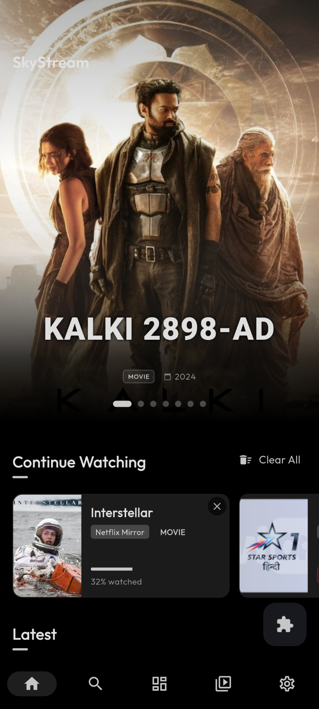
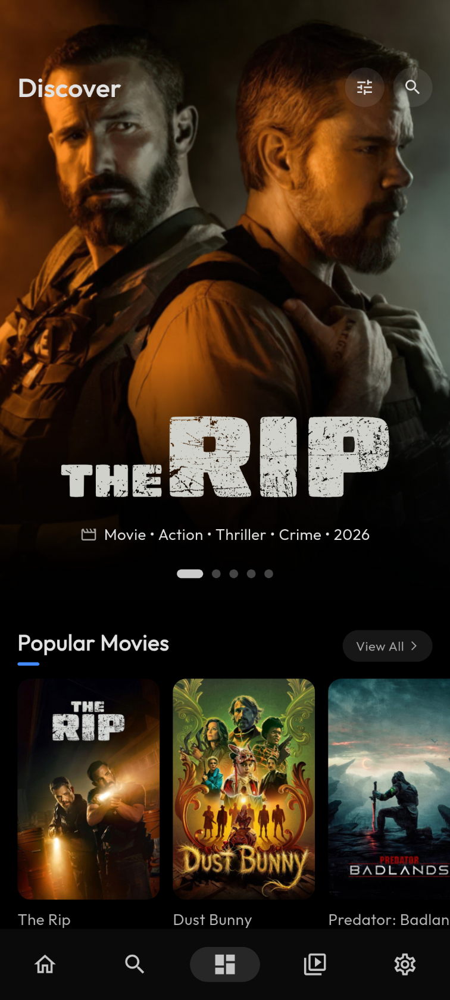
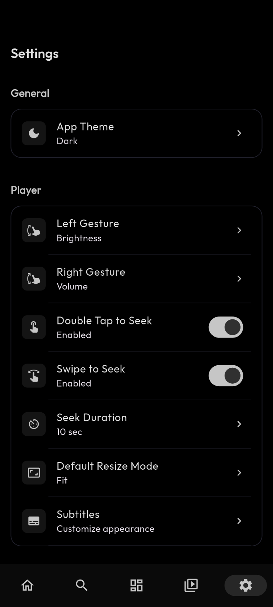

# SkyStream

<div align="center">
  <a href="https://github.com/akashdh11/skystream/releases">
    
  </a>
  <a href="https://github.com/akashdh11/skystream/stargazers">
    
  </a>
  <a href="https://github.com/akashdh11/skystream/releases">
    
  </a>
  <a href="https://github.com/akashdh11/skystream/issues">
    
  </a>
  <a href="https://github.com/akashdh11/skystream/issues?q=is%3Aissue+is%3Aclosed">
    
  </a>
  <a href="https://github.com/akashdh11/skystream/commits/main">
    
  </a>
</div>


**⚠️ Warning: By default, this app doesn't provide any video sources; you have to install extensions to add functionality to the app.**

**A new, cross-platform media streaming application inspired by CloudStream.**

> **Note**: This project is an independent application built with Flutter. While it supports similar extension formats, it is a simplified, modern re-imagining and is **not** a direct clone or fork of the official client.

**Please don't create illegal extensions or use any that host any copyrighted media.** This project does not condone copyright infringement.

## Community

Join the discussion, get help, or find new extensions on our Telegram channel or Discord server:

<a href="https://t.me/+Ez5Vsv2pUUFjZmNl">
  
</a>

<br>


<a href="https://discord.gg/73XGA8Mxn9">
  
</a>


## Overview

SkyStream is a modern, media streaming client. It draws inspiration from the versatile architecture of CloudStream but implements a custom, cross-platform JavaScript engine for extensions, enabling support for Android, iOS, and Desktop from a single codebase.

### Built With

   

### Screenshots

### 📱 Mobile

<p align="center">
  
    
  
  
</p>

### 📺 Large screen

<p align="center">
  
  
</p>

## Supported Platforms

| Platform       |         Support          |
|:---------------|:------------------------:|
| **Android**    |            ✅             |
| **Android TV** |            ✅             |
| **iOS**        | ✅ (Sideloading required) |
| **Windows**    |            ✅             |
| **macOS**      |            ✅             |
| **Linux**      |            ✅             |

## ✨ Key Features

| Feature | Description |
| :--- | :--- |
| **📺 Extensions System** | Install custom JavaScript plugins to Scrape & Stream content from any source. |
| **📂 Direct Playback** | Instant zero-copy playback for **Local Files** (MP4/MKV) and **Torrents/Magnet Links**. |
| **🔗 Network Streams** | Play arbitrary video URLs (M3U8, MP4) directly from settings. |
| **⏱️ Smart History** | "Continue Watching" across all media types with robust progress tracking. |
| **⚡ Performance** | Optimized for **90Hz/120Hz** displays, ensuring a buttery smooth experience. |
| **🎨 Modern UI** | Material 3 Design, Dynamic Colors, and responsive layouts for Phones, Tablets, and Desktop. |
| **🌍 Multi-language** | 40+ supported languages including Hindi, Spanish, French, German, and more. |
| **💬 Subtitles** | Support for **External SRT/VTT** files, online search (OpenSubtitles/SubDL/SubSource), and synchronization. |

## 📥 Installation

Download the latest version from the **[Releases Page](https://github.com/akashdh11/skystream/releases/latest)**.

### 🤖 Android / Android TV
1. Download the `skystream-android-arm64-v8a-v2.2.1.apk` (recommended for most modern phones) or `skystream-android-armeabi-v7a-v2.2.1.apk` (for TV) from Releases.
2. Open the file and tap **Install**.
   - *Note: You may need to allow "Install form Unknown Sources" in your browser settings.*
3. Open SkyStream and install extensions via **Settings > Extensions**.

### 🍏 iOS (Sideloading)
SkyStream is not on the App Store. You must **sideload** it using a computer.

**Requirements:**
- A Computer (Windows or macOS)
- [Impactor](https://impactor.khcrysalis.dev/) (Free and OpenSource) or [Sideloadly](https://sideloadly.io/) (Free)
- iTunes (if on Windows)

**Steps:**
1. Download `skystream-ios-unsigned-v2.2.1.ipa` from the [Releases Page](https://github.com/akashdh11/skystream/releases/latest).
2. Open **Impactor** or **Sideloadly** on your computer.
3. Connect your iPhone/iPad via USB.
4. Drag the `.ipa` file into the Sideloadly window.
5. Enter your **Apple ID** in the configured field.
6. Click **Start**.
7. Once finished, the app will appear on your home screen.
8. On your device, go to **Settings > General > VPN & Device Management**, tap your email, and select **Trust**.
9. Setup Wi-Fi sync to automatically refresh your apps in background

### 💻 Windows / macOS / Linux
1. Download the appropriate zip/tar file for your OS (`skystream-windows.zip`, `skystream-macos.zip`, `skystream-linux.tar.gz`, etc.).
2. Extract the archive.
3. Run the executable (`skystream.exe`, `skystream.app`, or `./skystream`).
   - *macOS Note: You may need to Right Click -> Open to bypass the "Unidentified Developer" warning.*
   - *Linux Note: You may need to install `libmpv` (e.g., `sudo apt install libmpv-dev` or `libmpv1`) for the player to work.*

## 🛠️ Build from Source

To set up the development environment, clone the repository and run the setup commands. Detailed instructions for environment configuration, platform-specific builds, and project architecture can be found in our contributor guide:

👉 **[CONTRIBUTING.md](docs/CONTRIBUTING.md)**

### Quick Start
```bash
git clone https://github.com/akashdh11/skystream.git
cd skystream
flutter pub get
flutter gen-l10n
flutter run
```

## 🤝 Contributing

We welcome contributions of all kinds! Whether you are fixing a bug, adding a feature, or helping with translations, your help is appreciated.

- **Found a bug?** Report it on our **[GitHub Issues](https://github.com/akashdh11/skystream/issues)** page.
- **Want to translate?** See our **[Translation Guide](docs/CONTRIBUTING_TRANSLATIONS.md)**.
- **Want to build a plugin?** Check the **[Extension Guide](docs/PLUGIN_DEVELOPMENT_GUIDE.md)**.
- **Need help?** Join the community on **[Discord](https://discord.gg/73XGA8Mxn9)** or **[Telegram](https://t.me/+Ez5Vsv2pUUFjZmNl)**.

---

## FAQ

<details>
<summary><b>How do I install extensions?</b></summary>
SkyStream uses `.sky` or `.js` extension files. You can install them by navigating to <b>Settings > Extensions > Add Repository</b> and entering a repository URL (e.g., using a shortcode).
</details>

<details>
<summary><b>Where is the media stored?</b></summary>
SkyStream is a streaming client and does not host any content. All media is streamed directly from the third-party extensions you install.
</details>


## Star History

## Star History

<a href="https://www.star-history.com/#akashdh11/skystream&Date">
 <picture>
   <source media="(prefers-color-scheme: dark)" srcset="https://api.star-history.com/svg?repos=akashdh11/skystream&type=date&theme=dark" />
   <source media="(prefers-color-scheme: light)" srcset="https://api.star-history.com/svg?repos=akashdh11/skystream&type=Date" />
   
 </picture>
</a>


## Contributors

<a href="https://github.com/akashdh11/skystream/graphs/contributors">
  
</a>

## License

[MIT](LICENSE)
