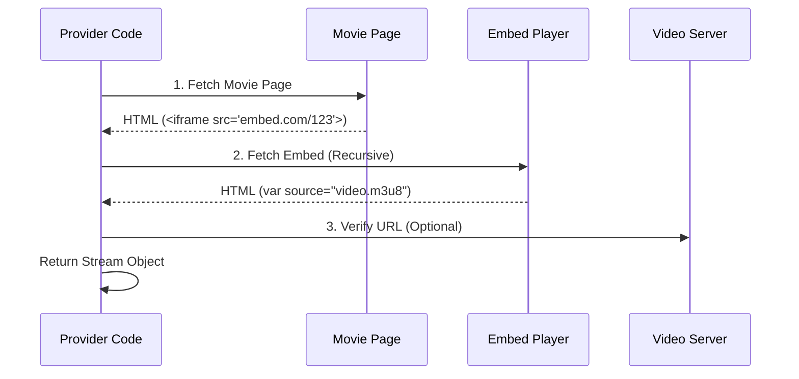

# How to Scrape & Create a New SkyStream JS Provider

This guide explains the foundational steps to scrape a *new* streaming website and turn it into a working SkyStream JavaScript provider.

For a comprehensive guide on testing, packaging, and releasing your plugin, see the **[Plugin Development Guide](PLUGIN_DEVELOPMENT_GUIDE.md)**.

---

## 2. The SkyStream JS Contract (Output Format)

Before you scrape, you must know **what** to render. The app expects strict JSON formats.

### A. The "Movie/Show" Object (Home & Search)
**Crucial**: The field names must strictly match the Dart model.
- `title` (not name)
- `posterUrl` (not image)
- `url` (not link)

**Format for `getHome()`**:
Must return a **Map** of sections:
```json
{
    "Trending": [
        {
            "title": "Avatar: The Way of Water",
            "url": "https://site.com/movie/avatar",
            "posterUrl": "https://site.com/poster.jpg",
            "headers": { "Referer": "..." } 
        }
    ]
}
```

**Format for `search()`**:
Must return a **List** of items:
```json
[
    {
        "title": "Batman",
        "url": "/movie/batman",
        "posterUrl": "..."
    }
]
```

### B. The "Stream" Object (Video Link)
When returning playable links:
```json
{
    "name": "1080p - Server VidCloud",
    "url": "https://cdn.com/master.m3u8",
    "headers": {
        "User-Agent": "Mozilla/5.0...", 
        "Referer": "https://embed.com/" 
    },
    // ...
}
```

---

## 3. The Scraping Workflow: "Reverse Engineering"

The goal is to find the **Direct API** or **Hidden JSON** that the website uses to load content. Parsing raw HTML is a last resort; APIs are always better.

### Step 1: Finding the Home Page Data
1.  Open Chrome DevTools (`F12` or `Right Click -> Inspect`).
2.  Go to the **Network** tab.
3.  Filter by **Fetch/XHR** (this shows API calls).
4.  Reload the home page (`https://example-movie.com`).
5.  **Look for**:
    *   Requests returning JSON.
    *   Endpoints like `/api/featured`, `/wp-json/v2/posts`, or `/ajax/home`.
6.  **Action**:
    *   If you find specific JSON requests, copy the URL. This will be your `getHome()` source.
    *   If *no* JSON calls appear and the data is in the HTML `Doc`, you will need to scrape the HTML using Regex.

**Flowchart: Identifying the Data Source**
```mermaid
graph TD
    A[Open DevTools Network Tab] --> B[Reload Page]
    B --> C{Filter: Fetch/XHR}
    C -- Requests Found --> D[Copy API URL]
    C -- Empty --> E[Check HTML 'Doc' tab]
    E --> F[Scrape with Regex]
    D --> G[Use for getHome()]
```

### Step 2: Finding Search Logic
1.  In DevTools Network tab, clear the logs (🚫 icon).
2.  Type a query into the site's search bar (e.g., "Avatar") and hit Enter.
3.  Watch the Network log.
    *   **Case A (API)**: A request appears: `GET /api/search?q=Avatar`. -> **EASY MODE**. Use this URL in your `search()` function.
    *   **Case B (Form Submit)**: The page reloads to `/search/Avatar`. -> **HTML MODE**. You must fetch this URL and parse the HTML results.

### Step 3: The "Details" Page (Metadata)
1.  Click on a movie poster.
2.  Observe the URL (e.g., `/movie/avatar-2009`).
3.  Check the Network tab again.
    *   Does it load the video ID via AJAX?
    *   Is the Stream URL hidden in a variable like `var stream = "..."` in the page source?
    *   **Tip**: Right-click the page -> "View Page Source". Ctrl+F to search for `.mp4`, `.m3u8`, or `video`.

### Step 4: Extracting the Video Link (The Hardest Part)
This is where 90% of providers fail. Sites try to hide links.

**Strategy:**
1.  **Look for M3U8**: Filter Network tab by `.m3u8`. This is the best format (HLS).
2.  **Look for MP4**: Filter by `.mp4`. Good backup.
3.  **Trace the Origin**:
    *   **Direct**: The URL was in the HTML embed code.
    *   **Iframe**: The site loads an external player (e.g., `vidcloud.net/embed/123`).
        *   *Action*: You must write a `load()` function that fetches the movie page -> extracts the Iframe URL -> fetches the Iframe page -> extracts the `.m3u8` link.

**Debugging 403 Forbidden Errors**:
If the video link works in Chrome but fails in CloudStream:
*   **Referer Check**: The server likely requires the `Referer` header (usually the URL of the page hosting the iframe).
*   **Cookie Check**: Rare, but some sites require a session cookie.
*   **User-Agent**: Ensure your provider sends a standard Desktop User-Agent.

**Flowchart: The Recursive Iframe Strategy**


---

## 2. Implementing in JavaScript (`provider.js`)

Create a new file (e.g., `my_new_provider.js`).

### Template Structure
```javascript
const mainUrl = "https://example-movie.com";
const commonHeaders = {
    "User-Agent": "Mozilla/5.0 (Windows NT 10.0; Win64; x64) AppleWebKit/537.36..."
};

function getManifest() {
    // ID must be unique and consistent! 
    // It is used to match updates and persist data. 
    // Format: com.yourname.providername
    return { name: "My New Provider", id: "com.mynew.provider", version: 1, baseUrl: mainUrl };
}
```

### Implementing `getHome()`
**Scenario**: The site uses HTML only (no JSON API).

```javascript
function getHome(callback) {
    // 1. Fetch the page
    http_get(mainUrl, commonHeaders, (status, html) => {
        // 2. Parse HTML with Regex
        // Pattern: <a href="/movie/avatar" title="Avatar">
        const regex = /<a href="([^"]+)" title="([^"]+)">.*? {
        // 2. Parse (Logic often identical to getHome!)
        var movies = [];
        // ... (regex logic from getHome) ...
        
        callback(JSON.stringify([
            { title: "Search Results", Data: movies }
        ]));
    });
}
```

### Implementing `load()` (Metadata)
**Scenario**: Extract details and prepare for streaming.

```javascript
function load(url, callback) {
    http_get(url, commonHeaders, (status, html) => {
        // 1. Extract Metadata using Regex
        var title = html.match(/class="title">([^<]+)/)?.[1] || "Unknown";
        var desc = html.match(/class="plot">([^<]+)/)?.[1] || "";
        var year = html.match(/class="year">(\d{4})/)?.[1];

        // 2. Prepare Data for 'loadStreams'
        // If the stream link is hidden in the HTML, we can extract it here 
        // and pass it as 'data' to the next step.
        // Example: var videoId = html.match(/data-id="(\d+)"/)[1];
        
        callback(JSON.stringify({
            url: url,          // Pass-through ID
            data: html,        // Pass full HTML to next step (or just videoId)
            title: title,
            description: desc,
            year: parseInt(year),
        }));
    });
}
```

### Implementing `loadStreams()` (Recursive Fetching)
**Scenario**: Page has an iframe.

```javascript
function loadStreams(url, callback) {
    // Step 1: Fetch Movie Page
    http_get(url, commonHeaders, (status, html) => {
        
        // Step 2: Find the Iframe URL
        // <iframe src="https://embed.com/play/12345">
        const iframeRegex = /<iframe[^>]+src="([^"]+)"/;
        const match = html.match(iframeRegex);
        
        if (!match) return callback("[]"); // Fail
        
        const iframeUrl = match[1];
        
        // Step 3: Fetch the Iframe
        http_get(iframeUrl, commonHeaders, (s, iframeHtml) => {
             
             // Step 4: Find the M3U8 link in the Iframe source
             // var source = "https://cdn.com/video.m3u8";
             const videoRegex = /file:\s*"([^"]+\.m3u8)"/;
             const videoMatch = iframeHtml.match(videoRegex);
             
             if (videoMatch) {
                 callback(JSON.stringify([{
                     name: "Auto",
                     url: videoMatch[1],
                     headers: commonHeaders // Always pass headers!
                 }]));
             } else {
                 callback("[]");
             }
        });
    });
}
```

---

## 3. Advanced Techniques

### 🕵️ Handling "Packed" or Obfuscated Code
If the website source looks like `eval(function(p,a,c,k,e,d)...`, this is **Dean Edwards Packer**.
*   **Solution**: You cannot run `eval()` easily.
*   **Workaround**: Use Regex to extract the internal list if possible, or search for a different source. CloudStream JS engine *can* technically run generic JS, but heavy deobfuscation scripts might timeout.

### 🕵️ Handling Headers & Referers
Many sites check the `Referer`.
*   **Problem**: Video 403s when played.
*   **Fix**:
    ```javascript
    headers: {
        "User-Agent": "...",
        "Referer": "https://embed.com/" // The Iframe URL usually
    }
    ```

### 🕵️ POST Requests
Some search APIs use `POST` instead of `GET`.
```javascript
// Function signature for POST is usually specific to the bridge implementation
// If standard http_post isn't available, rely on http_get with encoded params or custom helpers
```
*Note: Check `js_engine.dart` to see if `http_post` is explicitly exposed. In the current iteration, we primarily use `http_get`.*

---

## 4. Testing & Debugging

Since you cannot easily run this JS on your PC, you debug via the CloudStream App.

### 1. `console.log()`
*   **Constraint**: Standard `console.log` prints to the **Android Logcat**, not a visible console in the app.
*   **How to view**: Connect phone to PC, use Android Studio "Logcat" tab, filter by "CloudStream" or "JS".

### 2. Validation Steps
1.  **Thumbnails**: Do images load? (Check `Referer`).
2.  **Search**: Does typing "Batman" return results?
3.  **Playback**: 
    *   **Infinite Spinner**: Usually means `headers` are missing. The player is getting a 403/401 error.
    *   **"No Streams Found"**: Your regex failed. Add logging: `console.log("HTML: " + html)` to see what you actually fetched.

---

## 📕 Glossary

*   **API (Fetch/XHR)**: A direct data link. The "easy mode" for scraping where the site gives you clean JSON.
*   **M3U8 / HLS**: A standard streaming playlist file. This is the "Gold Standard" URL you are looking for.
*   **Iframe**: A "website inside a website". Streaming sites use this to host the player on a different server (e.g., `vidcloud.net`) to avoid copyright takedowns. You scrape the *main* site to find the *iframe link*, then scrape the *iframe* to find the video.
*   **Referer**: A header that tells the server "I came from example.com". If you don't send this, the video server thinks you are a bot and blocks you (403 Forbidden).
